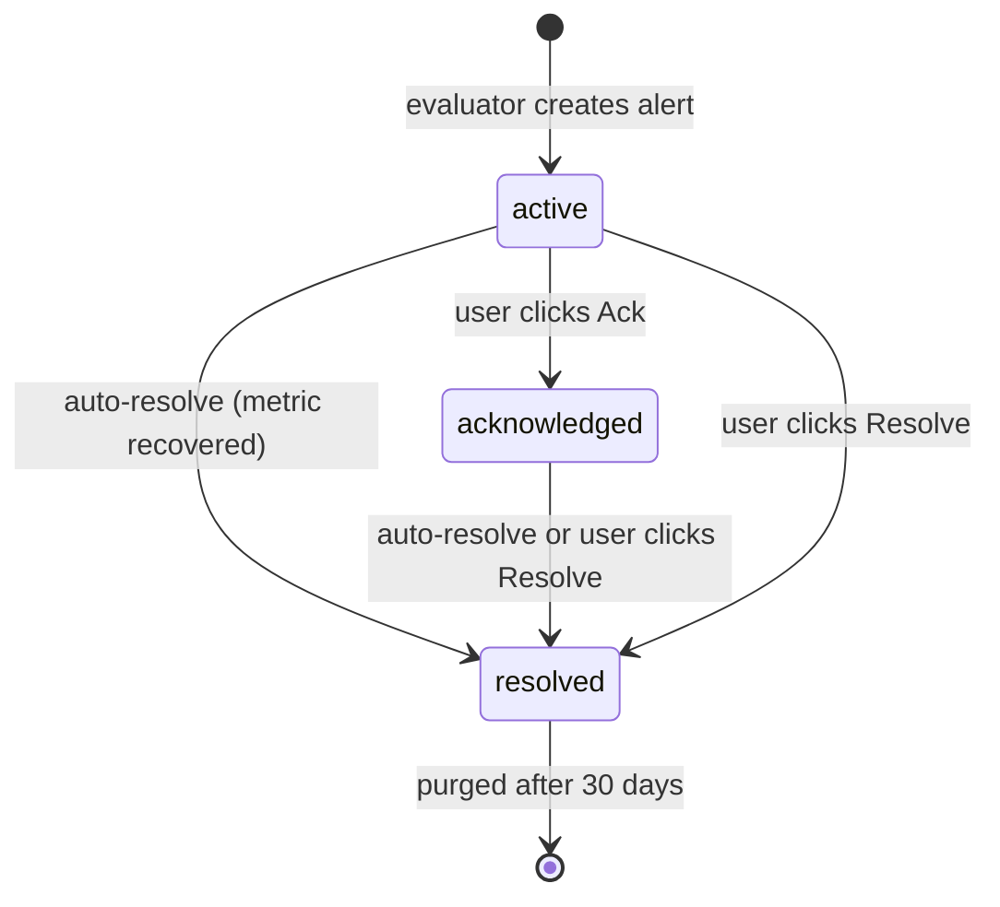

+++
title = "Manage Firing Alerts"
description = "The firing-alerts list — filters, acknowledge, resolve, bell-icon count, and history."
weight = 52
date = 2026-04-23

[extra]
toc = true
+++

Rules describe *what* should fire; this page is about *what is actually firing right now*. Everything here reads from the `alerts` table via `/api/alerts`, `/api/alerts/count`, and `/api/alerts/[id]`.

---

## The firing-alerts list

The alerts view lives at `/alerts` (firing tab) and is also surfaced as a slide-out panel from the bell icon in the header. Both render the same data through the `useAlerts(status)` SWR hook, which polls `GET /api/alerts?status=<state>` every 15 seconds.

> 📸 **Screenshot needed:** `/images/alerts/firing-list.png`
> **Page to capture:** `/alerts` (firing tab)
> **What to show:** Full-page firing alerts list with rows grouped by severity, showing entity name, message, fired-at relative time, and inline **Ack** / **Resolve** buttons.

Each row shows:

- **Severity badge** — red pill for `critical`, yellow pill for `warning`.
- **Entity name** — hostname, cluster name, or whatever `entityName` the evaluator resolved at fire time (`entity.hostname ?? entity.name ?? entity.id`).
- **Message** — the auto-generated `"<entityName>: <metric> is <actualValue> (<op> <threshold>)"` string stored on the alert row at fire time.
- **Fired-at** — rendered as "3 minutes ago" via `date-fns` `formatDistanceToNow`.
- **Actions** — `Ack` and `Resolve` buttons that hit `PATCH /api/alerts/<id>` with the corresponding action.

---

## Bell-icon count

The bell in the top-right header is backed by `GET /api/alerts/count` (hook: `useAlertCount`, 15-second refresh). The endpoint runs:

```sql
SELECT severity, COUNT(*) FROM alerts
WHERE status = 'active'
GROUP BY severity
```

and returns `{ total, critical, warning }`. The UI shows:

- **No badge** when `total === 0`.
- **Yellow badge** when there are only warnings.
- **Red badge** when there is at least one critical alert.
- **`99+`** when the count exceeds two digits.

> 📸 **Screenshot needed:** `/images/alerts/firing-bell-badge.png`
> **Page to capture:** Any dashboard page with active alerts
> **What to show:** Header bell icon with a red `3` badge and the slide-out panel expanded to show the three alerts.

Only **active** alerts count toward the badge — acknowledged and resolved alerts do not. This is deliberate: the badge represents "things that still need a human".

---

## Filters

The list supports filtering by:

| Filter | Query param | Values |
|---|---|---|
| State | `status` | `active`, `acknowledged`, `resolved` |
| Severity | `severity` | `warning`, `critical` |
| Entity type | `entityType` | `host`, `compute_cluster`, `storage_cluster` |

Filters combine with `AND`. `limit` defaults to 100 and `offset` defaults to 0 for pagination.

The embedded bell panel also has a three-way **All / Critical / Warning** tab that filters client-side against the already-fetched active list.

> 📸 **Screenshot needed:** `/images/alerts/firing-filters.png`
> **Page to capture:** `/alerts` (firing tab with filter chips active)
> **What to show:** Filter bar with `state: active`, `severity: critical`, `entity: host` chips applied and a narrowed result set.

Alerts are keyed by `entityType` and `entityId`. To trace an alert back to a specific NQRust Hypervisor connector, jump to the entity in the Fleet view and cross-reference from there.

---

## State transitions



- **active** — freshly fired. Counts toward the bell badge.
- **acknowledged** — a human has seen it but not closed it. `acknowledged_at` is set. Still visible in the list but no longer counts toward the badge.
- **resolved** — either the metric recovered (auto) or someone clicked Resolve. `resolved_at` is set. Hidden from the active view; visible in history.

### Acknowledge

`PATCH /api/alerts/<id>` with `{ "action": "acknowledge" }`. Only valid when the alert is `active`. Under the hood:

```sql
UPDATE alerts SET status = 'acknowledged', acknowledged_at = NOW()
WHERE id = $1 AND status = 'active'
```

### Resolve (manual)

`PATCH /api/alerts/<id>` with `{ "action": "resolve" }`. Valid when the alert is `active` or `acknowledged`. Forces:

```sql
UPDATE alerts SET status = 'resolved', resolved_at = NOW()
WHERE id = $1 AND status IN ('active', 'acknowledged')
```

The evaluator will re-create the alert on the next tick if the metric is still breaching — manually resolving an ongoing problem is a temporary action.

### Auto-resolve

On every evaluation tick, any active or acknowledged alert whose rule+entity pair no longer triggers the comparison is flipped to `resolved` via `batchAutoResolve`. You do not need to clean these up by hand; a recovered host is off the board within 60 seconds of recovery.

---

## History

To see resolved alerts, switch the state filter to `resolved` (or query `GET /api/alerts?status=resolved`). Results come back ordered by `fired_at DESC` with `resolved_at` populated. This is how you reconstruct "what fired overnight" after everything has auto-resolved.

> 📸 **Screenshot needed:** `/images/alerts/firing-history.png`
> **Page to capture:** `/alerts?status=resolved`
> **What to show:** Resolved alerts list showing `fired_at` and `resolved_at` columns with the duration of each incident.

{}
Resolved alerts older than 30 days are automatically purged from the `alerts` table by `purgeOldAlerts()` and cannot be recovered. If you need a longer audit trail, export rows to an external store before they age out.
{}

---

## Deletion and CSRF

Firing-alert rows do not expose a `DELETE` endpoint — the only way a row leaves the `alerts` table is through the 30-day retention sweep on resolved alerts. Users cannot delete an active alert; they can only acknowledge, resolve, or wait for auto-resolve.

Rule-level deletion, however, is a user-initiated CSRF-guarded action:

- `DELETE /api/alert-rules/<id>` deletes the rule and, via `ON DELETE CASCADE` on `alerts.rule_id`, all alerts it ever produced — including resolved history.

Every mutating request in the alerts area (`POST`, `PATCH`, `PUT`, `DELETE`) requires:

- A valid session (`requireSession()` on each route).
- An `x-csrf-token` header matching the `csrf_token` cookie. The client hooks in `lib/api/alert-hooks.ts` read the cookie and attach the header automatically, but direct API consumers must do the same.

{}
Deleting a rule deletes **every firing and historical alert** tied to that rule — including ones you may still need for audit. Disable the rule first (`enabled: false`) if you only want to silence it; delete only when you are sure.
{}

---

## Related

- [Connectors](../connectors/) — the NQRust Hypervisor connector is the metrics source upstream of every firing alert.
- [Fleet & Monitoring](../fleet/) — jump from a firing alert to the live entity view.
- [Settings › Authentication](../settings/authentication/) — who can acknowledge, resolve, or delete.
