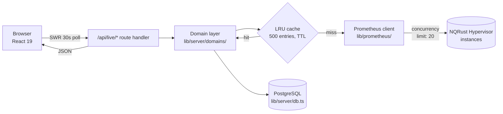
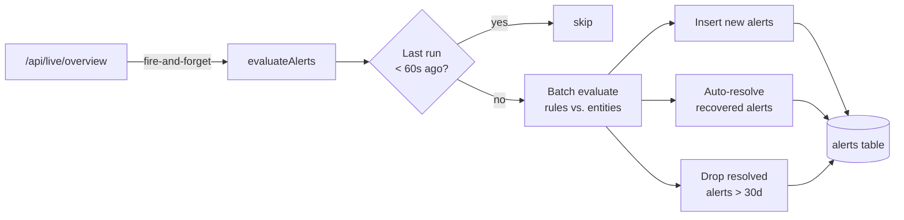

+++
title = "Architecture"
description = "How InfraWatch aggregates NQRust Hypervisor data into a single Next.js app."
weight = 70
date = 2026-04-23

[extra]
toc = true
+++

InfraWatch is a single Next.js 16 application that terminates the browser UI, owns a PostgreSQL database, and fans out to NQRust Hypervisor instances through a concurrency-limited HTTP client. Each NQRust Hypervisor node exposes an embedded Prometheus endpoint that InfraWatch queries for host, VM, and cluster telemetry. Everything in this section — the request path, the layer boundaries, the alert loop, and the scaling knobs — reflects what the code actually does today. If you want the authoritative source, start in `lib/server/` and `app/api/`.

---

## Request path

Every page in the dashboard polls a `/api/live/*` endpoint every 30 seconds through SWR. The request travels through the App Router, into the domain layer, hits the LRU cache, and — only on a cache miss — reaches the NQRust Hypervisor's embedded Prometheus.



{}
A single `/api/live/overview` call warms the caches for hosts, compute clusters, storage clusters in one sweep — subsequent page-specific polls hit hot cache entries for the remainder of the TTL window.
{}

---

## Layers

```mermaid
flowchart TB
    subgraph UI["UI (app/)"]
        SC[Server Components<br/>page.tsx]
        CC[Client Components<br/>SWR hooks, Radix, Recharts]
    end
    subgraph API["Route Handlers (app/api/*)"]
        AuthR[auth/login, logout, me]
        ConnR[connectors, [id]/test]
        LiveR[live/overview, hosts, ...]
        AlertR[alerts, alert-rules]
        PromR[prometheus/query, query_range]
        LicR[license/*]
        SsoR[auth/sso/*, settings/sso]
    end
    subgraph Domain["Domain layer (lib/server/domains/)"]
        Hosts[hosts.ts]
        CCl[compute-clusters.ts]
        SCl[storage-clusters.ts]
                VMs[vms.ts]
        Apps[apps.ts]
    end
    subgraph Infra["Shared infrastructure"]
        CacheL[cache.ts<br/>LRU 500 + TTL]
        PromC[lib/prometheus/client.ts<br/>20 concurrent queries]
        DBP[db.ts<br/>pg Pool]
        Eval[alert-evaluator.ts<br/>throttled, batched]
    end
    UI --> API
    API --> Domain
    API --> Infra
    Domain --> Infra
    PromC --> HV[(NQRust Hypervisor #1..#N)]
    DBP --> PG[(PostgreSQL)]
```

### UI

- **Server Components** render the initial shell and any data that is safe to emit during SSR.
- **Client Components** own polling state (SWR), charts (Recharts), forms, and the command palette (`cmdk`). They talk exclusively to `/api/*` endpoints — they never reach into `lib/server/` directly.

### Route handlers (`app/api/*`)

Each folder under `app/api/` is an endpoint; `route.ts` exports `GET`/`POST`/`PATCH`/`PUT`/`DELETE`. Handlers keep work small: authenticate, parse, call into the domain layer, and shape the JSON response. See the [API Reference](../../api-reference/) for every route.

### Domain layer (`lib/server/domains/`)

The domain layer is the only place that knows how to translate PromQL results into the dashboard's view models (`HostRow`, `ComputeCluster`, `StorageCluster`, etc.). It composes queries, fans out across all enabled connectors in parallel, and deduplicates overlapping results.

### Prometheus client (`lib/prometheus/`)

A single HTTP client instance serves every domain module. It queries the embedded Prometheus endpoint that each NQRust Hypervisor node exposes. It enforces a **global concurrency limit of 20 in-flight queries** across all connectors. Further requests queue behind the limiter, so a burst of dashboard polls can never exhaust the upstream query capacity.

### Cache (`lib/server/cache.ts`)

An in-process LRU with **500 entries** and per-entry TTLs. Keys are namespaced (`live:hosts`, `live:overview`, etc.) so `invalidatePrefix("live:")` can flush everything connector-related after a mutation. The cache is process-local by design — see [Scaling notes](#scaling-notes) for multi-instance deployments.

### Database (`lib/server/db.ts`)

A `pg` Pool configured from `DATABASE_URL`. `DATABASE_SSL=true` flips on TLS for remote PostgreSQL. All persistent state — connectors, alerts, sessions, SSO configs, audit log, license — lives here.

---

## Alert evaluator

`lib/server/alert-evaluator.ts` runs the alert pipeline against the same data the dashboard sees, piggybacking on the live cache instead of issuing extra queries to NQRust Hypervisor.



Key properties:

- **Throttled**: at most one evaluation per 60 seconds regardless of how often the overview endpoint is hit.
- **Batched**: all rules run against all entities in a single sweep; inserts, updates, and resolutions use batched SQL so write amplification stays constant.
- **Auto-resolve**: when the metric that fired an alert recovers, the evaluator flips its status to `resolved` and stamps `resolvedAt`.
- **30-day retention**: resolved alerts older than 30 days are purged automatically.

---

## Scaling notes

### Concurrency tuning

The global concurrency limit (20) is conservative — it prevents a single InfraWatch instance from overwhelming any one NQRust Hypervisor node's embedded Prometheus. If your hypervisor nodes can serve more concurrent queries, you can raise the limit in `lib/prometheus/client.ts`.

### Multi-instance deployments

InfraWatch is stateless apart from its cache. You can run several instances behind a load balancer (nginx, Caddy, HAProxy) as long as:

- Every instance points at the **same PostgreSQL database**. Sessions, connectors, alerts, audit log, and license state are all server-side.
- Sticky sessions are **not required** — session tokens live in PostgreSQL, not in process memory.
- Each instance maintains its **own LRU cache**. The trade-off is a small amount of duplicate work at cache-fill time, offset by the concurrency limiter. Prefer 2–3 mid-sized instances over one very large one when you approach the ~200-connector mark.

### Database

Compound indexes on the `alerts` table keep lookups sub-millisecond even at millions of rows. At the large end of the scale table (~10k hosts, 200 connectors) consider PgBouncer in front of PostgreSQL 16 and enable `DATABASE_SSL=true` on the InfraWatch side.

---

## Next steps

- [Data model](data-model/) — every table InfraWatch auto-provisions.
- [Security model](security-model/) — how credentials, sessions, and SSO are protected.
- [API Reference](../../api-reference/) — the endpoints the UI and alert evaluator actually call.
