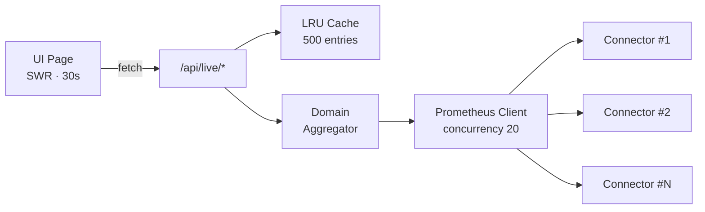

+++
title = "Fleet & Monitoring"
description = "Live hypervisor infrastructure health across hosts, clusters, VMs, storage, and applications"
weight = 40
date = 2026-04-23
sort_by = "weight"
template = "section.html"
page_template = "page.html"

[extra]
toc = true
+++

The **Fleet & Monitoring** section is where you spend most of your time in InfraWatch. It rolls NQRust Hypervisor telemetry into live views — overview, hosts, clusters, virtual machines, storage, and applications — each refreshed every 30 seconds by the browser.

{}
Every page in this section is powered by SWR polling (30-second interval) against `/api/live/*` endpoints. Those endpoints fan out to connectors, cache responses in an LRU of 500 entries, and return partial-data diagnostics when any connector fails — so the UI stays live even when a single NQRust Hypervisor connector is unreachable.
{}

---

## What's in This Section

### [Overview](overview/)
The main dashboard at `/`. Aggregate KPIs — connector health, total hosts, total VMs, storage usage — plus resource-utilization sparklines and top-N ranking panels for CPU, network, disk I/O, and storage pressure.

### [Hosts](hosts/)
The per-host inventory at `/hosts` (also reachable via `/nodes`) with drill-down to `/hosts/[id]`. CPU, memory, disk, network, load, uptime, and per-interface throughput for every node that reports to a connector.

### [Clusters](clusters/)
Compute clusters at `/clusters` group hosts that share labels (role, environment, cluster id). The detail view at `/clusters/[id]` shows aggregate cluster metrics and the member-host list.

### [Virtual Machines](virtual-machines/)
NQRust MicroVMs at `/vm`, with per-VM allocation, phase, host mapping, and drill-down to `/vm/[id]` for metrics and a host link.

### [Storage](storage/)
Storage clusters and pools at `/storage`, with capacity gauges, volume summaries (healthy / degraded / faulted), and filesystem inventories. Drill into `/storage/[id]` for read/write IOPS and per-pool detail.

### [Applications](applications/)
User-grouped applications at `/apps` — instances carrying an `app=<name>` label are rolled up into a single row with a health status derived from their backing hosts. Drill-down at `/apps/[id]`.

---

## How the Live Data Flows

All seven `/api/live/*` routes share the same cache. Opening the Overview warms data for the other pages, so clicking into Hosts or Clusters loads instantly for the first 30 seconds. When a connector returns an error, the response includes a `partialData` flag plus a `failedConnectors` list — the UI surfaces those as a yellow diagnostics banner.

---

## Related

- [Connectors](../connectors/) — add the NQRust Hypervisor sources that feed these pages
- [Alerts](../alerts/) — thresholds that fire against the same live data
- [Architecture](../architecture/) — internals of the LRU cache, SWR polling, and alert evaluator
