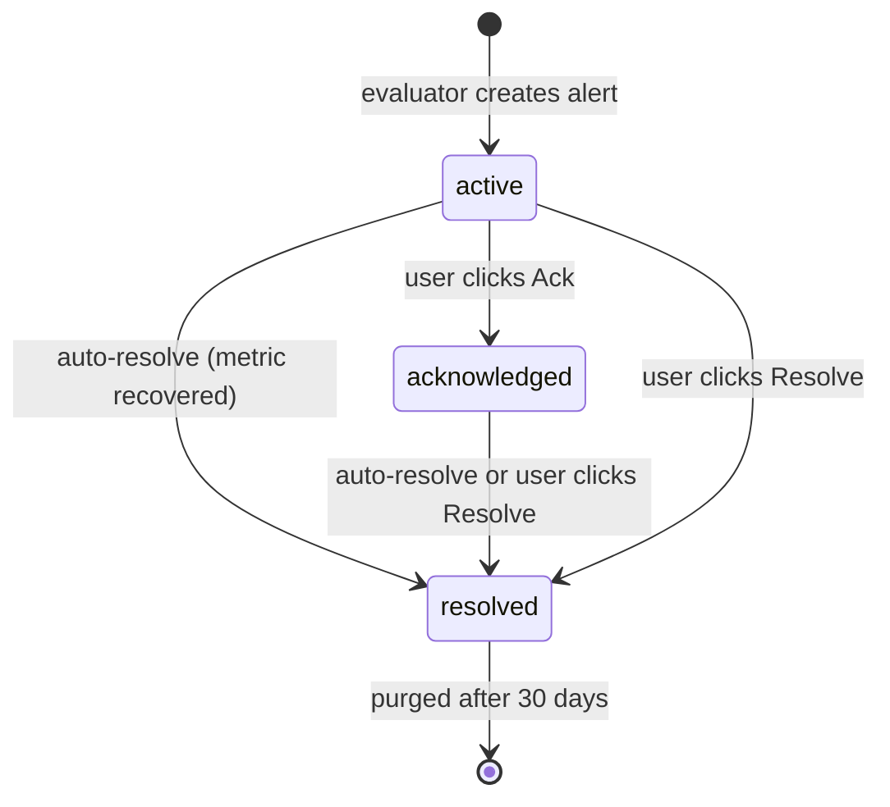

+++
title = "Kelola Firing Alerts"
description = "Daftar firing alert — filter, acknowledge, resolve, hitungan bell-icon, dan riwayat."
weight = 52
date = 2026-04-23

[extra]
toc = true
+++

Rule mendeskripsikan *apa* yang harus menyala; halaman ini tentang *apa yang benar-benar menyala saat ini*. Semua di sini dibaca dari tabel `alerts` via `/api/alerts`, `/api/alerts/count`, dan `/api/alerts/[id]`.

---

## Daftar firing alert

Tampilan alert berada di `/alerts` (tab firing) dan juga ditampilkan sebagai panel slide-out dari ikon bell di header. Keduanya me-render data yang sama melalui hook SWR `useAlerts(status)`, yang melakukan polling `GET /api/alerts?status=<state>` setiap 15 detik.

> 📸 **Screenshot needed:** `/images/alerts/firing-list.png`
> **Page to capture:** `/alerts` (tab firing)
> **What to show:** Daftar firing alerts full-page dengan baris dikelompokkan berdasarkan severity, menampilkan nama entity, pesan, waktu relatif fired-at, dan tombol **Ack** / **Resolve** inline.

Setiap baris menampilkan:

- **Badge severity** — pill merah untuk `critical`, pill kuning untuk `warning`.
- **Nama entity** — hostname, nama cluster, atau `entityName` apapun yang di-resolve evaluator saat fire (`entity.hostname ?? entity.name ?? entity.id`).
- **Pesan** — string `"<entityName>: <metric> is <actualValue> (<op> <threshold>)"` yang dihasilkan otomatis dan disimpan di baris alert saat fire.
- **Fired-at** — di-render sebagai "3 menit yang lalu" via `formatDistanceToNow` dari `date-fns`.
- **Aksi** — tombol `Ack` dan `Resolve` yang memanggil `PATCH /api/alerts/<id>` dengan aksi yang sesuai.

---

## Hitungan bell-icon

Bell di header kanan atas didukung oleh `GET /api/alerts/count` (hook: `useAlertCount`, refresh 15-detik). Endpoint menjalankan:

```sql
SELECT severity, COUNT(*) FROM alerts
WHERE status = 'active'
GROUP BY severity
```

dan mengembalikan `{ total, critical, warning }`. UI menampilkan:

- **Tanpa badge** ketika `total === 0`.
- **Badge kuning** ketika hanya ada warning.
- **Badge merah** ketika ada minimal satu alert critical.
- **`99+`** ketika hitungan melebihi dua digit.

> 📸 **Screenshot needed:** `/images/alerts/firing-bell-badge.png`
> **Page to capture:** Halaman dashboard apapun dengan alert aktif
> **What to show:** Ikon bell di header dengan badge `3` merah dan panel slide-out diperluas menampilkan ketiga alert.

Hanya alert **active** yang dihitung ke badge — alert yang di-acknowledge dan resolved tidak. Ini disengaja: badge merepresentasikan "hal-hal yang masih butuh tindakan".

---

## Filter

Daftar mendukung filter berdasarkan:

| Filter | Query param | Nilai |
|---|---|---|
| State | `status` | `active`, `acknowledged`, `resolved` |
| Severity | `severity` | `warning`, `critical` |
| Entity type | `entityType` | `host`, `compute_cluster`, `storage_cluster` |

Filter digabungkan dengan `AND`. `limit` default ke 100 dan `offset` default ke 0 untuk pagination.

Panel bell yang tertanam juga memiliki tab tiga-arah **All / Critical / Warning** yang memfilter di sisi klien terhadap daftar aktif yang sudah diambil.

> 📸 **Screenshot needed:** `/images/alerts/firing-filters.png`
> **Page to capture:** `/alerts` (tab firing dengan chip filter aktif)
> **What to show:** Bar filter dengan chip `state: active`, `severity: critical`, `entity: host` diterapkan dan hasil yang dipersempit.

Alert dikunci berdasarkan `entityType` dan `entityId`. Untuk menelusuri alert ke connector NQRust Hypervisor tertentu, buka entity di tampilan Fleet dan lakukan cross-reference dari sana.

---

## Transisi state



- **active** — baru saja menyala. Dihitung ke badge bell.
- **acknowledged** — seseorang telah melihatnya tapi belum menutupnya. `acknowledged_at` di-set. Masih terlihat di daftar tetapi tidak lagi dihitung ke badge.
- **resolved** — baik metric pulih (otomatis) atau seseorang mengklik Resolve. `resolved_at` di-set. Tersembunyi dari tampilan active; terlihat di riwayat.

### Acknowledge

`PATCH /api/alerts/<id>` dengan `{ "action": "acknowledge" }`. Hanya valid ketika alert berstatus `active`. Di balik layar:

```sql
UPDATE alerts SET status = 'acknowledged', acknowledged_at = NOW()
WHERE id = $1 AND status = 'active'
```

### Resolve (manual)

`PATCH /api/alerts/<id>` dengan `{ "action": "resolve" }`. Valid ketika alert adalah `active` atau `acknowledged`. Memaksa:

```sql
UPDATE alerts SET status = 'resolved', resolved_at = NOW()
WHERE id = $1 AND status IN ('active', 'acknowledged')
```

Evaluator akan membuat ulang alert pada tick berikutnya jika metric masih melanggar — me-resolve masalah yang sedang berlangsung secara manual adalah tindakan sementara.

### Auto-resolve

Pada setiap tick evaluasi, setiap alert active atau acknowledged yang pasangan rule+entity-nya tidak lagi memicu perbandingan dibalik menjadi `resolved` via `batchAutoResolve`. Tidak perlu membersihkan ini secara manual; host yang pulih akan keluar dari daftar dalam 60 detik setelah pemulihan.

---

## Riwayat

Untuk melihat alert yang sudah resolved, alihkan filter state ke `resolved` (atau panggil `GET /api/alerts?status=resolved`). Hasil kembali terurut berdasarkan `fired_at DESC` dengan `resolved_at` terisi. Inilah cara merekonstruksi "apa yang menyala semalam" setelah semuanya auto-resolve.

> 📸 **Screenshot needed:** `/images/alerts/firing-history.png`
> **Page to capture:** `/alerts?status=resolved`
> **What to show:** Daftar alert yang resolved menampilkan kolom `fired_at` dan `resolved_at` dengan durasi tiap insiden.

{}
Alert yang resolved lebih dari 30 hari akan di-purge otomatis dari tabel `alerts` oleh `purgeOldAlerts()` dan tidak dapat dipulihkan. Jika diperlukan audit trail yang lebih panjang, ekspor baris ke penyimpanan eksternal sebelum kedaluwarsa.
{}

---

## Penghapusan dan CSRF

Baris firing-alert tidak mengekspos endpoint `DELETE` — satu-satunya cara baris meninggalkan tabel `alerts` adalah melalui sapuan retensi 30 hari pada alert yang resolved. Alert aktif tidak bisa dihapus langsung; hanya bisa di-acknowledge, di-resolve, atau dibiarkan auto-resolve.

Penghapusan pada level rule adalah aksi yang diinisiasi pengguna dan dilindungi CSRF:

- `DELETE /api/alert-rules/<id>` menghapus rule dan, via `ON DELETE CASCADE` pada `alerts.rule_id`, semua alert yang pernah dihasilkannya — termasuk riwayat yang resolved.

Setiap request mutasi di area alerts (`POST`, `PATCH`, `PUT`, `DELETE`) memerlukan:

- Session yang valid (`requireSession()` di setiap route).
- Header `x-csrf-token` yang cocok dengan cookie `csrf_token`. Hook klien di `lib/api/alert-hooks.ts` membaca cookie dan melampirkan header secara otomatis, tapi konsumen API langsung harus melakukan hal yang sama.

{}
Menghapus sebuah rule akan menghapus **setiap firing dan historical alert** yang terikat pada rule itu — termasuk yang mungkin masih diperlukan untuk audit. Nonaktifkan rule terlebih dahulu (`enabled: false`) jika hanya ingin meng-silence-nya; hapus hanya jika sudah yakin.
{}

---

## Terkait

- [Connectors](../connectors/) — connector NQRust Hypervisor adalah sumber metric upstream dari setiap firing alert.
- [Fleet & Monitoring](../fleet/) — lompat dari firing alert ke tampilan entity live.
- [Settings › Authentication](../settings/authentication/) — siapa yang dapat acknowledge, resolve, atau delete.
