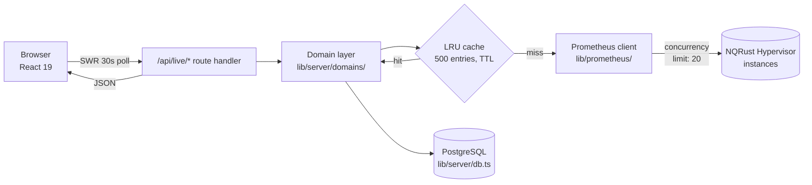
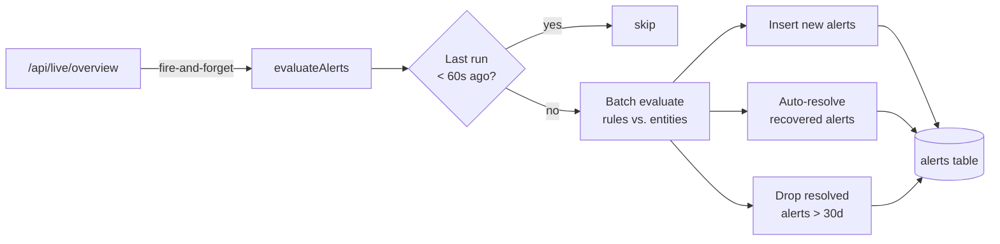

+++
title = "Arsitektur"
description = "Bagaimana InfraWatch mengagregasi data NQRust Hypervisor ke dalam satu aplikasi Next.js."
weight = 70
date = 2026-04-23

[extra]
toc = true
+++

InfraWatch adalah satu aplikasi Next.js 16 yang menerminasi UI browser, memiliki basis data PostgreSQL, dan menyebar permintaan ke node-node NQRust Hypervisor melalui klien HTTP dengan batas konkurensi. Setiap node NQRust Hypervisor mengekspos endpoint Prometheus bawaan yang di-query InfraWatch untuk mengambil telemetri host, VM, dan cluster. Semua yang ada di bagian ini — jalur permintaan, batas antar-layer, loop alert, dan tombol penyesuaian skala — mencerminkan apa yang benar-benar dilakukan kode saat ini. Jika ingin sumber otoritatif, mulailah dari `lib/server/` dan `app/api/`.

---

## Jalur permintaan

Setiap halaman di dashboard melakukan polling ke endpoint `/api/live/*` setiap 30 detik melalui SWR. Permintaan melewati App Router, masuk ke layer domain, mengenai cache LRU, dan — hanya pada saat cache miss — mencapai Prometheus bawaan NQRust Hypervisor.



{}
Satu panggilan `/api/live/overview` memanaskan cache untuk host, compute cluster, storage cluster dalam satu sapuan — polling spesifik halaman berikutnya akan mengenai entri cache panas selama sisa jendela TTL.
{}

---

## Layer

```mermaid
flowchart TB
    subgraph UI["UI (app/)"]
        SC[Server Components<br/>page.tsx]
        CC[Client Components<br/>SWR hooks, Radix, Recharts]
    end
    subgraph API["Route Handlers (app/api/*)"]
        AuthR[auth/login, logout, me]
        ConnR[connectors, [id]/test]
        LiveR[live/overview, hosts, ...]
        AlertR[alerts, alert-rules]
        PromR[prometheus/query, query_range]
        LicR[license/*]
        SsoR[auth/sso/*, settings/sso]
    end
    subgraph Domain["Domain layer (lib/server/domains/)"]
        Hosts[hosts.ts]
        CCl[compute-clusters.ts]
        SCl[storage-clusters.ts]
                VMs[vms.ts]
        Apps[apps.ts]
    end
    subgraph Infra["Shared infrastructure"]
        CacheL[cache.ts<br/>LRU 500 + TTL]
        PromC[lib/prometheus/client.ts<br/>20 concurrent queries]
        DBP[db.ts<br/>pg Pool]
        Eval[alert-evaluator.ts<br/>throttled, batched]
    end
    UI --> API
    API --> Domain
    API --> Infra
    Domain --> Infra
    PromC --> HV[(NQRust Hypervisor #1..#N)]
    DBP --> PG[(PostgreSQL)]
```

### UI

- **Server Components** merender shell awal dan data apa pun yang aman untuk dipancarkan selama SSR.
- **Client Components** memiliki state polling (SWR), chart (Recharts), form, dan command palette (`cmdk`). Semuanya hanya berkomunikasi ke endpoint `/api/*` — tidak pernah mengakses `lib/server/` secara langsung.

### Route handler (`app/api/*`)

Setiap folder di bawah `app/api/` adalah satu endpoint; `route.ts` mengekspor `GET`/`POST`/`PATCH`/`PUT`/`DELETE`. Handler menjaga pekerjaannya tetap kecil: autentikasi, parsing, memanggil layer domain, dan membentuk respons JSON. Lihat [API Reference](../../api-reference/) untuk setiap route.

### Layer domain (`lib/server/domains/`)

Layer domain adalah satu-satunya tempat yang tahu cara menerjemahkan hasil PromQL ke dalam view model dashboard (`HostRow`, `ComputeCluster`, `StorageCluster`, dll). Layer ini menyusun query, menyebar secara paralel ke semua connector yang aktif, dan menghilangkan duplikat hasil yang tumpang tindih.

### Klien Prometheus (`lib/prometheus/`)

Satu instance klien HTTP melayani setiap modul domain. Klien ini mengambil data dari endpoint Prometheus bawaan yang diekspos setiap node NQRust Hypervisor. Klien menegakkan **batas konkurensi global 20 query in-flight** untuk seluruh connector. Permintaan selebihnya antre di belakang limiter, sehingga lonjakan polling dashboard tidak akan menguras kapasitas query di sisi hypervisor.

### Cache (`lib/server/cache.ts`)

LRU in-process dengan **500 entri** dan TTL per-entri. Key diberi namespace (`live:hosts`, `live:overview`, dll) sehingga `invalidatePrefix("live:")` dapat membersihkan semua hal terkait connector setelah mutasi. Cache bersifat process-local by design — lihat [Catatan penskalaan](#catatan-penskalaan) untuk deployment multi-instance.

### Basis data (`lib/server/db.ts`)

`pg` Pool yang dikonfigurasi dari `DATABASE_URL`. `DATABASE_SSL=true` mengaktifkan TLS untuk PostgreSQL jarak jauh. Semua state persisten — connector, alert, session, konfigurasi SSO, audit log, lisensi — disimpan di sini.

---

## Alert evaluator

`lib/server/alert-evaluator.ts` menjalankan pipeline alert terhadap data yang sama yang dilihat dashboard, memanfaatkan cache live alih-alih mengeluarkan query tambahan ke NQRust Hypervisor.



Properti utama:

- **Throttled**: paling banyak satu evaluasi per 60 detik, berapa pun seringnya endpoint overview dipanggil.
- **Batched**: semua rule dijalankan terhadap semua entity dalam satu sapuan; insert, update, dan resolusi menggunakan SQL batched sehingga write amplification tetap konstan.
- **Auto-resolve**: ketika metric yang memicu alert pulih, evaluator mengubah status-nya menjadi `resolved` dan mencap `resolvedAt`.
- **Retensi 30 hari**: alert yang sudah resolved lebih tua dari 30 hari dibersihkan secara otomatis.

---

## Catatan penskalaan

### Penyesuaian konkurensi

Batas konkurensi global (20) bersifat konservatif — batas ini mencegah satu instance InfraWatch membanjiri Prometheus bawaan pada node NQRust Hypervisor mana pun. Jika node hypervisor dapat melayani lebih banyak query bersamaan, batas dapat dinaikkan di `lib/prometheus/client.ts`.

### Deployment multi-instance

InfraWatch bersifat stateless kecuali cache-nya. Beberapa instance dapat dijalankan di belakang load balancer (nginx, Caddy, HAProxy) selama:

- Setiap instance menunjuk ke **basis data PostgreSQL yang sama**. Session, connector, alert, audit log, dan state lisensi semuanya berada di sisi server.
- Sticky session **tidak diperlukan** — token session berada di PostgreSQL, bukan di memori proses.
- Setiap instance memelihara **cache LRU-nya sendiri**. Konsekuensinya adalah sedikit pekerjaan yang terduplikasi pada saat pengisian cache, yang diimbangi oleh limiter konkurensi. Lebih baik 2–3 instance berukuran menengah daripada satu instance yang sangat besar ketika mendekati angka ~200 connector.

### Basis data

Compound index pada tabel `alerts` menjaga lookup tetap di bawah satu milidetik bahkan pada jutaan baris. Di ujung besar tabel skala (~10rb host, 200 connector) pertimbangkan PgBouncer di depan PostgreSQL 16 dan aktifkan `DATABASE_SSL=true` di sisi InfraWatch.

---

## Langkah selanjutnya

- [Data model](data-model/) — setiap tabel yang diprovisioning otomatis oleh InfraWatch.
- [Security model](security-model/) — bagaimana kredensial, session, dan SSO dilindungi.
- [API Reference](../../api-reference/) — endpoint yang benar-benar dipanggil UI dan alert evaluator.
