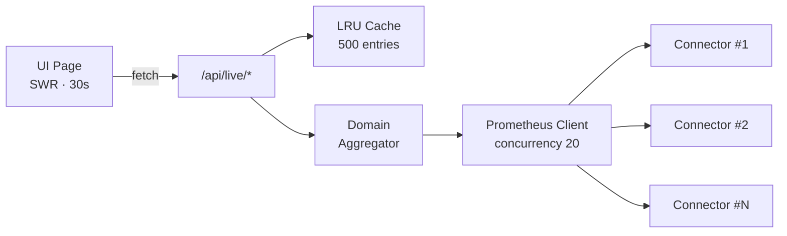

+++
title = "Fleet & Monitoring"
description = "Kesehatan infrastruktur hypervisor secara live pada host, cluster, VM, storage, dan aplikasi"
weight = 40
date = 2026-04-23
sort_by = "weight"
template = "section.html"
page_template = "page.html"

[extra]
toc = true
+++

Bagian **Fleet & Monitoring** adalah tempat menghabiskan sebagian besar waktu di InfraWatch. Bagian ini menggabungkan telemetri NQRust Hypervisor ke dalam serangkaian tampilan live — overview, host, cluster, virtual machine, storage, dan aplikasi — yang masing-masing disegarkan setiap 30 detik oleh browser.

{}
Setiap halaman di bagian ini didukung oleh polling SWR (interval 30 detik) terhadap endpoint `/api/live/*`. Endpoint tersebut menyebarkan permintaan ke connector, melakukan cache respons dalam LRU berisi 500 entri, dan mengembalikan diagnostik partial-data saat salah satu connector gagal — sehingga UI tetap live meskipun satu connector NQRust Hypervisor tidak dapat dijangkau.
{}

---

## Apa yang Ada di Bagian Ini

### [Ringkasan](overview/)
Dashboard utama di `/`. KPI agregat — kesehatan connector, total host, total VM, penggunaan storage — ditambah sparkline resource-utilization dan panel peringkat top-N untuk CPU, jaringan, disk I/O, dan tekanan storage.

### [Host](hosts/)
Inventaris per-host di `/hosts` (juga dapat diakses melalui `/nodes`) dengan drill-down ke `/hosts/[id]`. CPU, memori, disk, jaringan, load, uptime, dan throughput per-interface untuk setiap node yang melapor ke connector.

### [Cluster](clusters/)
Cluster compute di `/clusters` mengelompokkan host yang berbagi label (role, environment, cluster id). Tampilan detail di `/clusters/[id]` menunjukkan metrik cluster agregat dan daftar host anggota.

### [Virtual Machine](virtual-machines/)
NQRust MicroVM di `/vm`, dengan alokasi per-VM, phase, pemetaan host, dan drill-down ke `/vm/[id]` untuk metrik dan tautan ke host.

### [Storage](storage/)
Cluster dan pool storage di `/storage`, dengan gauge kapasitas, ringkasan volume (healthy / degraded / faulted), dan inventaris filesystem. Drill ke `/storage/[id]` untuk IOPS read/write dan detail per-pool.

### [Aplikasi](applications/)
Aplikasi yang dikelompokkan di `/apps` — instance yang membawa label `app=<name>` digabungkan menjadi satu baris dengan status kesehatan yang diturunkan dari host pendukungnya. Drill-down di `/apps/[id]`.

---

## Bagaimana Data Live Mengalir

Ketujuh route `/api/live/*` berbagi cache yang sama. Membuka halaman Ringkasan akan memanaskan data untuk halaman lainnya, sehingga mengklik ke Host atau Cluster termuat secara instan selama 30 detik pertama. Ketika sebuah connector mengembalikan error, respons menyertakan flag `partialData` ditambah daftar `failedConnectors` — UI memunculkannya sebagai banner diagnostik kuning.

---

## Terkait

- [Connectors](../connectors/) — tambahkan sumber NQRust Hypervisor yang memberi data ke halaman-halaman ini
- [Alerts](../alerts/) — threshold yang dipicu terhadap data live yang sama
- [Arsitektur](../architecture/) — internals dari LRU cache, polling SWR, dan evaluator alert
